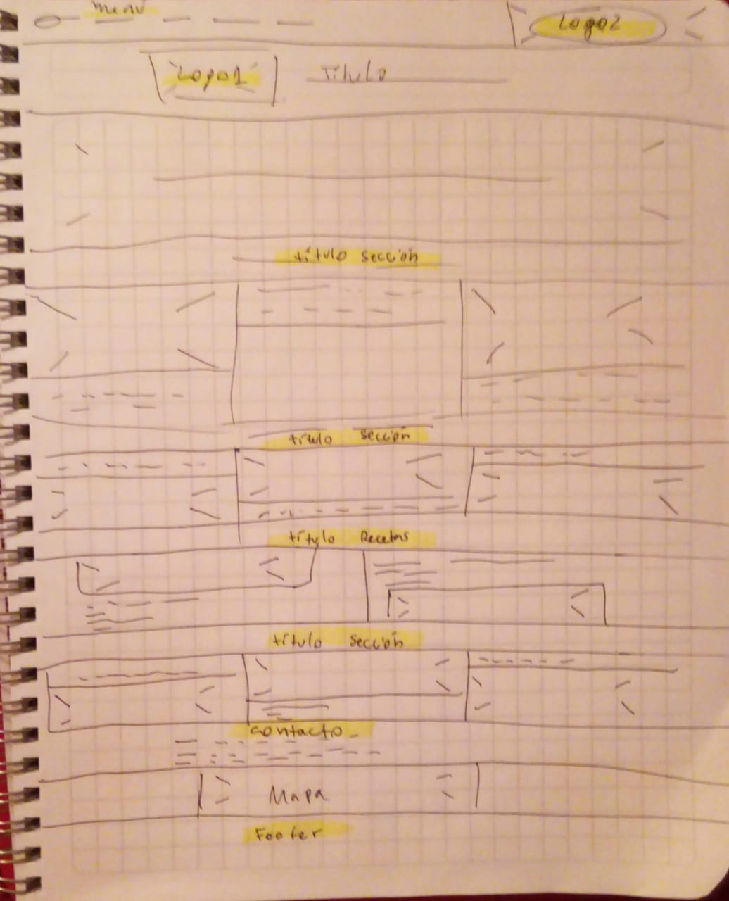
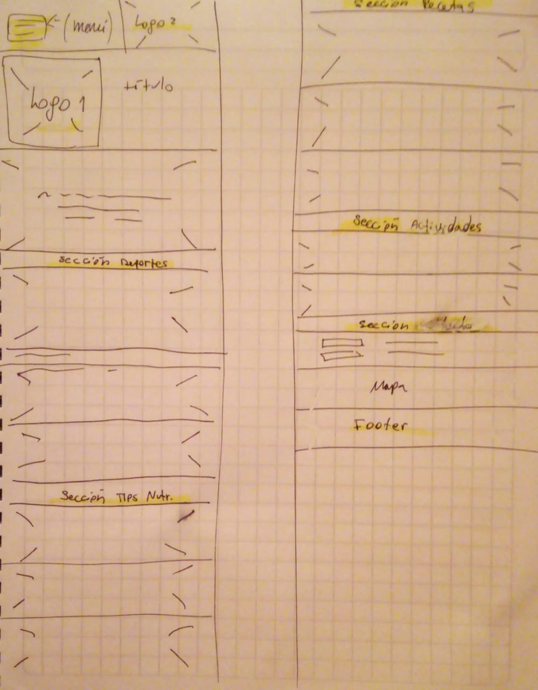

https://ninags.github.io/SegundoEntregable/

# Página Web de Vida Sana en la comuna

## -Requisitos generales
  - Una barra de navegación y un footer. Cada uno mostrando el logo.  
  - Siete secciones definiendo el nombre de las clases:
  - Sección "Header" donde se mostrará un título y una foto de fondo.
  - Sección "Eventos Deportivos".
  - Sección "Tips Nutricionales".
  - Sección "Recetas Sanas".
  - Sección "Actividades" con talleres.
  - Sección "Contacto".
  - La página debe ser responsiva.

## -Requisitos específicos
- Íconos para definir secciones.
 - *Usar "font awesome"*.
- Secciones con grilla
 - *Usar "bootstrap"*.
- Párrafos en general
 - *Creación de párrafos sin lorem ipsum"*. 
 
##-Requisitos visuales

- Layout:
 - *Usar Bootstrap*.
- Fuentes **
 
## -Especificación de clases

- Barra de navegación:
 - clase: navbar__navigation para el navbar
 - clase: menu
 - clase ***
- Sección Header 
 - clase header__***
- Sección Eventos Deportivos
 - clase "deportes"
- Sección Tips Nutricionales
 - clase "nutri"
- Sección Recetas Sanas
 - clase "recetas"
- Sección Actividades
 - clase "actividades"
- Sección Contacto
- clase "contacto"
- Footer
 - clase card_footer

## Diseño de Mockup (pre-maquetado)

## Diseño para Desktop

## Diseño para dispositivos móviles

# Primer_Proyecto_FInal
# segundo_entregable
# SegundoEntregable
